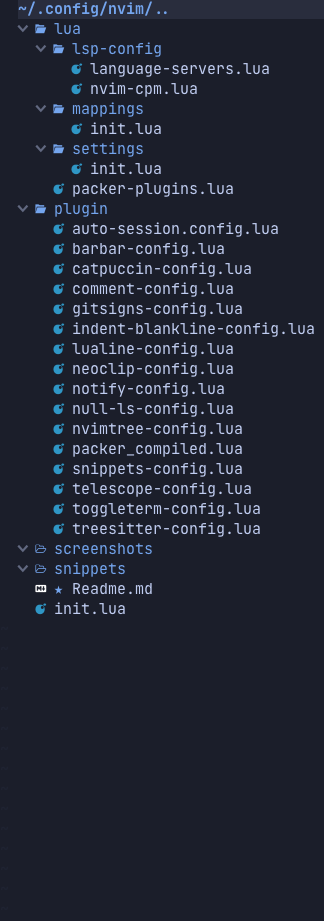
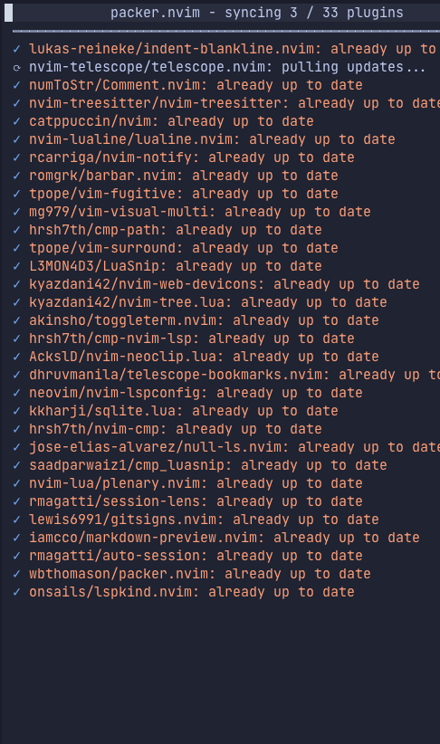
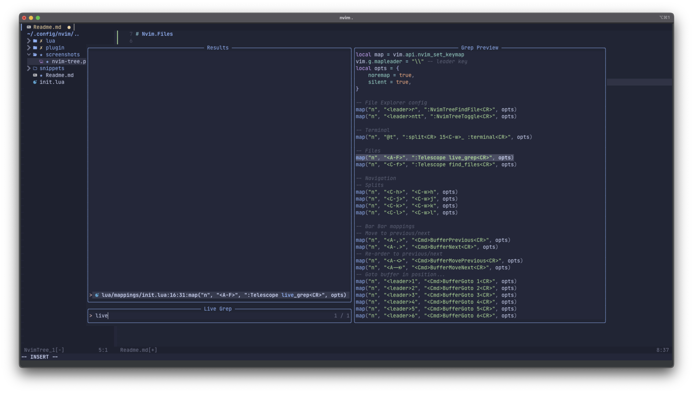
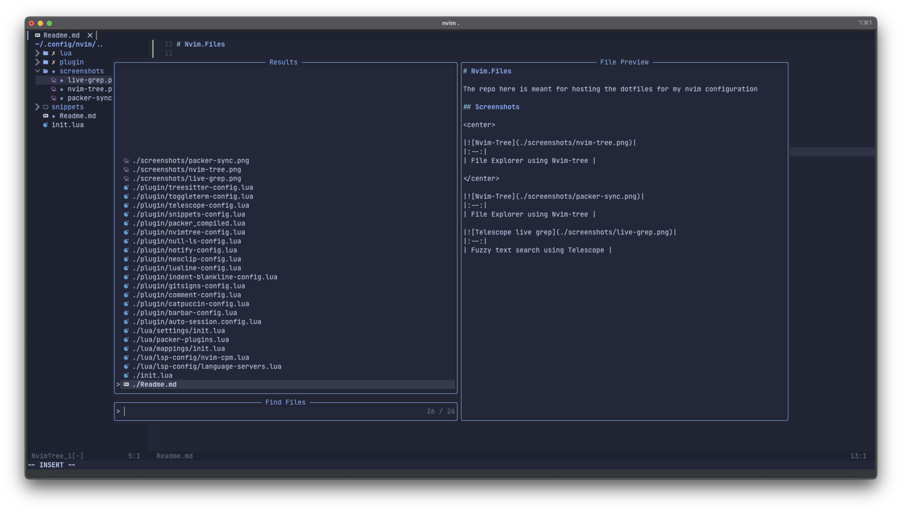
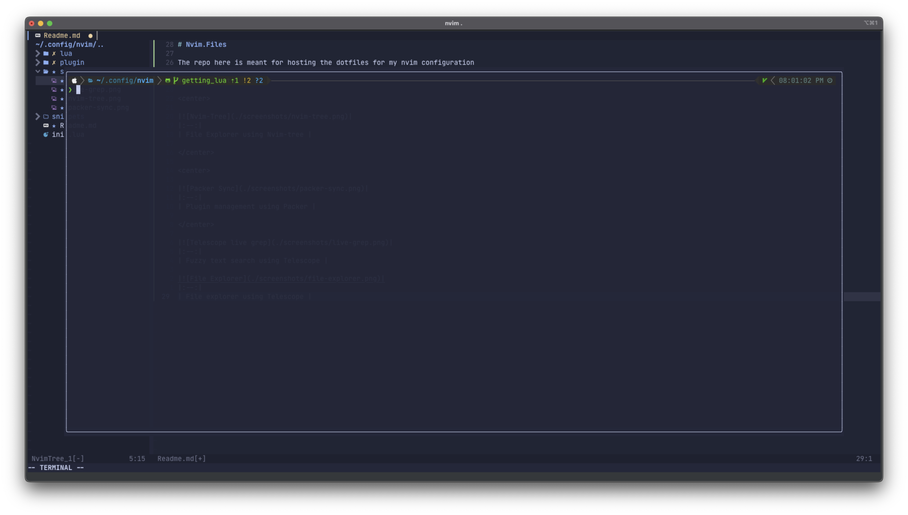

# Nvim.Files

The repo here is meant for hosting the dotfiles for my nvim configuration

## Screenshots

||
|:--:|
| File Explorer using Nvim-tree |

||
|:--:|
| Plugin management using Packer |

||
|:--:|
| Fuzzy text search using Telescope |

||
|:--:|
| File explorer using Telescope |

||
|:--:|
| Floating terminal using Toggle Term |
